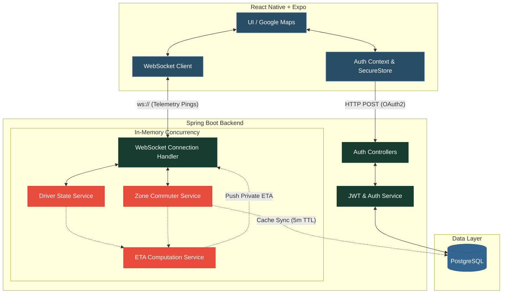

  
  <h1>agLugan Platform</h1>
  
<strong>High-Performance Real-Time Public Utility Vehicle (PUV) & Commuter Telemetry Platform</strong>

  

    
    
    
    
  

---

## 📱 Try the Live App (Staging)

Scan the QR code below with your Android phone to download the latest cloud-built APK and connect to the live Railway production server!

> *(QR Code will be placed here by the lead developer once the latest GitHub Action finishes building the APK!)*

---

## 📖 Overview

**agLugan** is an advanced, event-driven mobile platform designed to bridge the gap between public utility drivers (jeeps, buses, tricycles) and daily commuters. By providing a live, high-concurrency websocket layer, commuters can view approaching vehicles and real-time Estimated Times of Arrival (ETA), while drivers are empowered with live occupancy analytics at terminals and waiting sheds.

Built with performance in mind, the backend bypasses traditional database polling in favor of a vertically-scalable, lock-free in-memory architecture capable of handling thousands of simultaneous GPS telemetry pings.

---

## 🏗️ System Architecture

The system utilizes a split architecture. Authentication and metadata are handled via standard REST APIs, while all telemetry (GPS, ETAs, Live Occupancy) is streamed over a bi-directional WebSocket connection, processed entirely in-memory by Spring Boot to achieve sub-millisecond response times.

---

## 🚀 Advanced Engineering Concepts Used

To avoid the "Thundering Herd" problem and database bottlenecks common in real-time tracking apps, agLugan implements the following advanced backend patterns:

### ⚡ Lock-Free In-Memory State
Instead of writing GPS pings to a database, driver and commuter states are mapped into `ConcurrentHashMap`s. This utilizes advanced lock-striping, allowing hundreds of threads (users) to update their coordinates at the exact same millisecond without colliding or freezing the server.

### ⏱️ Event-Driven Math (No Polling)
The `EtaService` does not run on a background timer loop. ETAs are calculated *strictly* as a cascading event triggered by an incoming driver ping. The system calculates Haversine distances on the fly and only broadcasts an update down the WebSocket if the ETA has shifted by more than 20 seconds, drastically reducing network payload spam.

### 🛡️ Thundering Herd Protection
Geographic Zones (terminals/sheds) are cached in memory for 5 minutes. If 1,000 users ping the server the exact second the cache expires, a Double-Checked `synchronized` block forces 999 threads to wait for 1 millisecond while a single thread safely fetches the data from PostgreSQL, protecting the database from collapse.

### 🚰 Atomic Rate Limiting
Zone occupancy counts (showing drivers how many people are waiting at a terminal) are throttled globally using Java's `AtomicLong.compareAndSet()`. Regardless of how many commuters move simultaneously, the system guarantees an absolute maximum broadcast of 1 message every 2 seconds.

---

## ✨ Core Application Features

### 🔐 Security & Identity
- **Google OAuth2**: One-tap native login flow.
- **Persistent JWT Sessions**: Backed by Expo's `SecureStore`, ensuring tokens are cryptographically locked in the device's keychain.
- **Role-Based Access**: Dedicated backend handling and separate workflows for `USER` and `DRIVER` roles.

### 🗺️ Live Telemetry & Mapping
- **Battery-Optimized GPS**: Dynamic accuracy throttling. Drivers utilize `High` accuracy for precise vector math, while commuters are downgraded to `Balanced` to preserve their battery life.
- **Custom Aesthetic UI**: Tailored dark-themed map styles for high contrast and modern aesthetics.
- **Micro-Animations**: React Native `AnimatedRegion` provides fluid marker interpolation as drivers travel down the street.

### 📊 Smart Analytics
- **Live Occupancy Badges**: Real-time badges floating over map terminals showing exact commuter headcounts.
- **Dynamic Routing & Stops**: The backend automatically flags drivers as "Stopped" if their speed falls below 1.8km/h, pausing ETA countdowns for waiting commuters.

---

## 🛠️ Technology Stack

| Domain | Technology | Purpose |
| :--- | :--- | :--- |
| **Frontend App** | React Native, Expo | Cross-platform mobile client |
| **State Management**| React Context, SecureStore | Managing JWTs and user states globally |
| **Mapping** | `react-native-maps`, Google Maps | UI rendering of dynamic zones and telemetry |
| **Backend Server** | Java 17, Spring Boot 3 | Highly concurrent multi-threaded API |
| **Real-Time** | Spring WebSockets | Sub-millisecond bi-directional data streaming |
| **Database** | PostgreSQL | Persistence layer for Users, Drivers, and Zones |

---

> 🚧 **Disclaimer:** This project is currently in active development. Features are subject to change.
